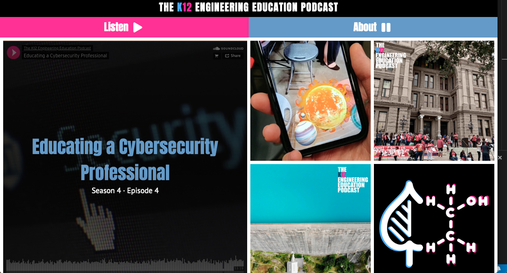
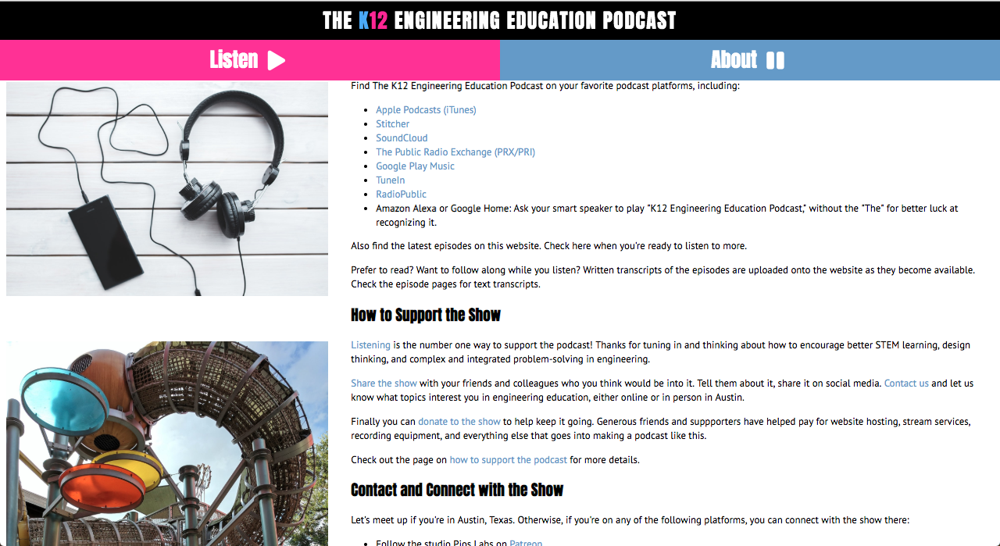
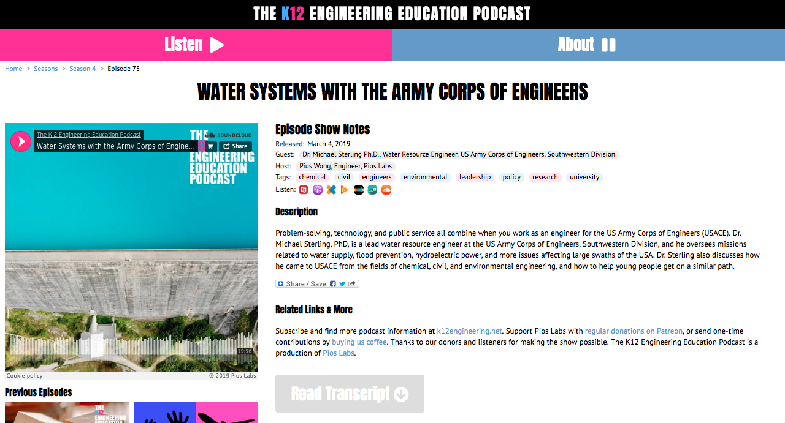

# The K12 Engineering Education Podcast 

This podcast is for all the educators, engineers, entrepreneurs, and parents out there who want to instill engineering thinking into young people. 

## Summary 
The K12 Engineering Education Podcast's purpose is to engage educators, engineers, entrepreneurs. I had the opportunity to work with two Austin area engineers, Pios Wong and Anthony Brown, to create the website for this podcast.
This is the landing page for The K12 Engineering Education podcast. It provides related written and audio links for users. 
For this project I scraped the static site for episode data, metadata, links and tags to populate the new website's database. 

## Technology 
[API](https://github.com/pieguyatx/tk12eep2018)

[Puppeteer](https://pptr.dev/)

[metascraper](https://metascraper.js.org/#)
